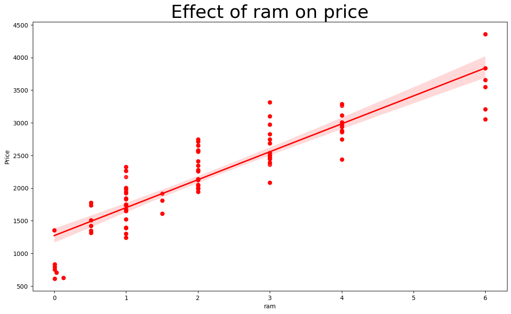
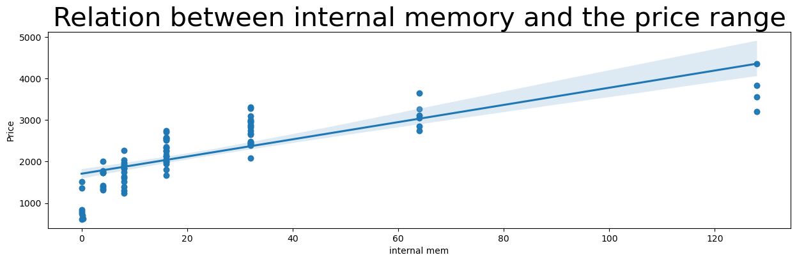
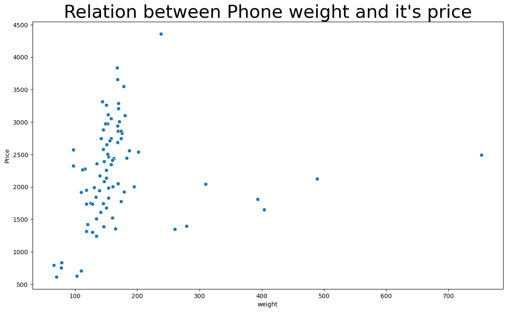
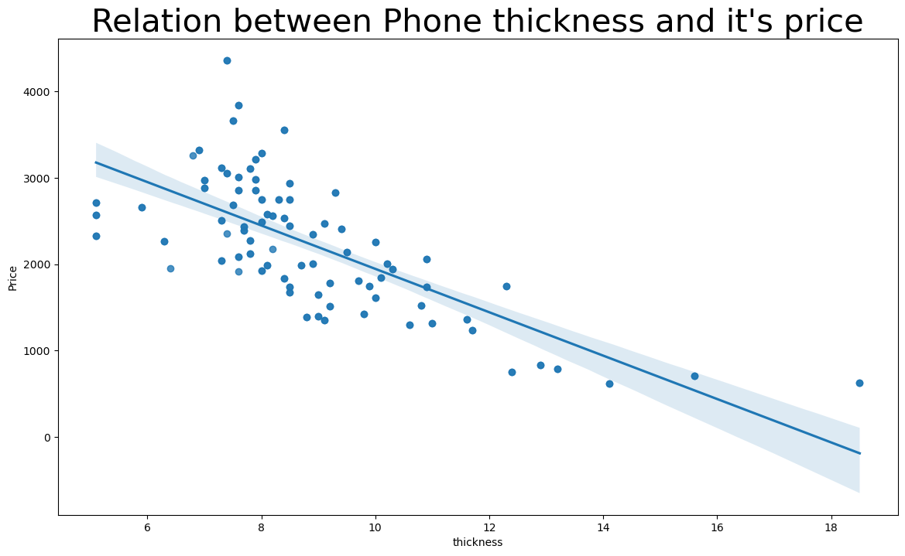
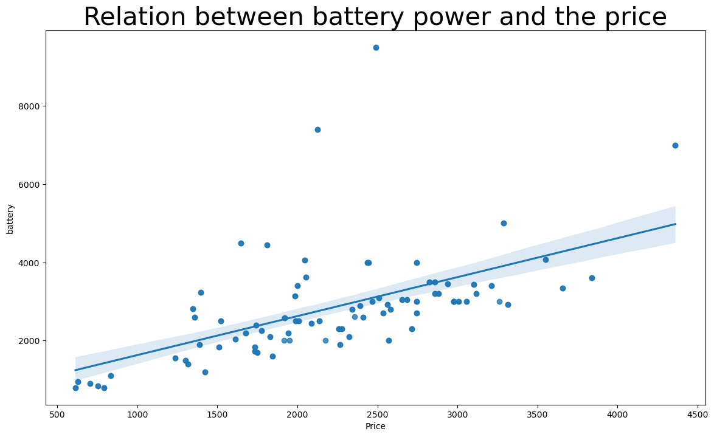
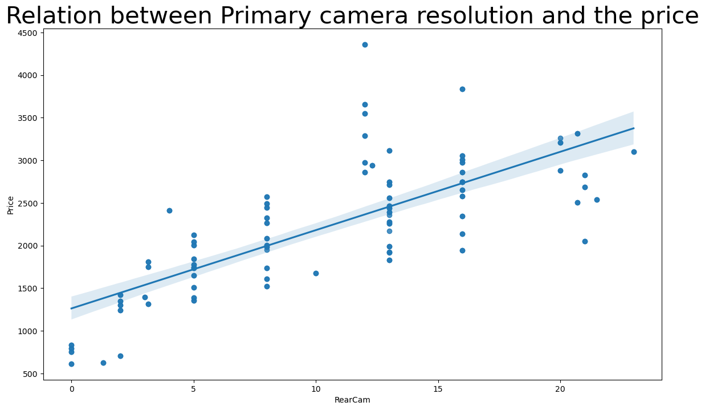
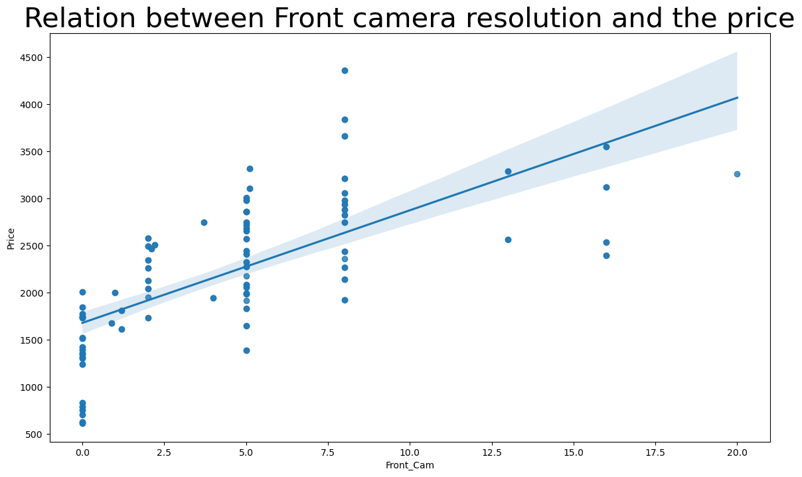
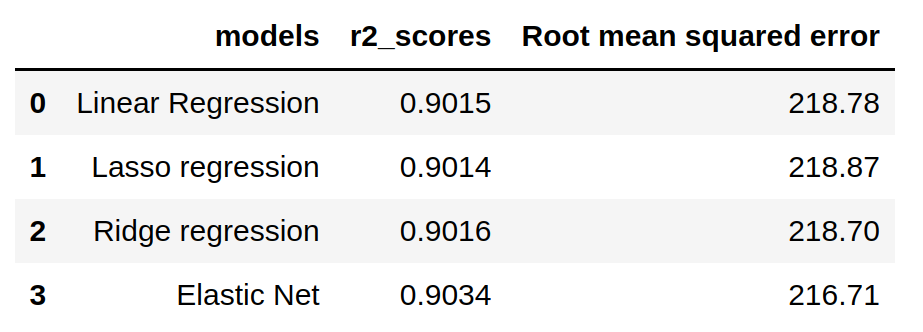
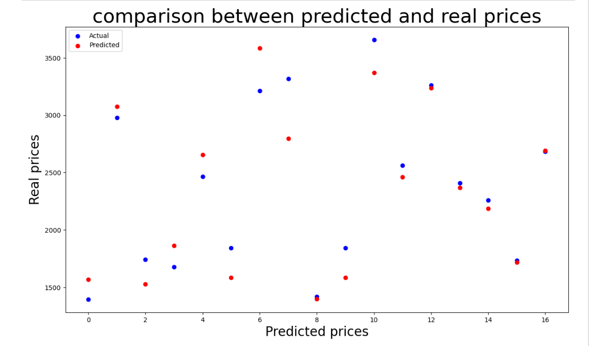

# Mobile price prediction

# Domain 
If you have a mobile company this project will make your life a lot easier. I know that when you try to sell your phones one of the most annoying things is what is the price tag that you should put in each smartphone. Nowadays with this huge numbers of smartphones with different specifications it must be really overwhelming. In this project I am going try to help you solve this problem by using different smart phones prices that we already know. I will try to help you in putting the right price tag on different smart phones to maximize your profits.

# Problem statement 

In this project I will use historical smart phones data like: sales, weight, resolution, internal memory etc.. to help us predict best price tags for new smart phones so we can maximize our profits.

# Usage

- This kind of prediction will help companies to  estimate the price of mobiles of an mobile phone based on its specifications.

- Beside that it will help Consumers to verify that they are paying best price according to the specs of the mobile.

# Solution approach
## Dataset
[This dataset](https://www.kaggle.com/datasets/mohannapd/mobile-price-prediction) is [the Mobile price prediction dataset](https://www.kaggle.com/datasets/mohannapd/mobile-price-prediction) from kaggle the reason why I chose this dataset is it's a new one so the specifications of the smart phones are new in addition to that it's a regression dataset and this problem is a regression problem so it fits amazingly in our solution.

- Product_id: ID of each cellphone.

- Price: Price of each cellphone.

- Sale: Sales number of each smart phone.

- weight: Weight of each cellphone.

- resolution: Resolution of each cellphone.

- PPI: Phone Pixel Density.

- CPU core: type of CPU core in each cellphone.

- CPU freq: CPU Frequency in each cellphone.

- internal mem: Internal memory of each cellphone.

- ram: RAM of each cellphone.

- RearCam: Resolution of the primary camera of each phone in pixels.

- Front_Cam: Resolution of the front camera of each phone in pixels.

- battery: Capacity of the battery of each phone in mAh.

- thickness: Thickness of each phone in mm.

## Platform

- This model here is a very light weight model and it's easy to train we can use it as a part of a website or a mobile application we can also use it as a desktop application.

- This model doesn't need a GPU to run as it's a machine learning model not a deep learning one and the dataset is relatively tiny so we don't need a powerful GPU to train this model your normal pc will train it easily.

## Algorithm details

After a lot of experiences the elastic net model of Scikit learn is the best model for this problem so let me just explain to you all the models that we used in this project briefly.

- Ridge Regression model: Ridge regression is a method to perform linear regression with fewer chances of a model getting into problems such as underfitting or overfitting.

    - It is used highly for the treatment of multicollinearity in regression, it means when an independent variable is correlated in such a way that both resemble each other. 

    - It causes high variance among the independent variables, we can change the value of the independent variable but it will cause a loss of information.

- Lasso Regression model: Lasso stands for Least Absolute Shrinkage Selector Operator.

    - It works the same as ridge regression when it comes to assigning the penalty for coefficient. 

    - It removes the coefficient and the variables with the help of this process and limits the bias through the below formula.

- Elastic Net Regression model: Coefficient to the variables are considered to be information that must be relevant, however, ridge regression does not promise to remove all irrelevant coefficient which is one of its disadvantages over Elastic Net Regression(ENR).

    - It uses both Lasso as well as Ridge Regression regularization in order to remove all unnecessary coefficients but not the informative ones.  

    - ENR = Lasso Regression + Ridge Regression.

# Contents
1. **About the data.**

2. **Importing the libraries and the data.**

3. **Understanding the data.**

4. **Data analysis and visualization.**

    1. How does ram is affected by price ?

    

    2. What is the relation between Internal Memory and Price Range ? 

    

    3. What is the relation between Phone weight and it's price ?

    
    

    4. What is the relation between Phone thickness and it's price ?

    
    
    
    5. What is the relation between Battery power and Price Range ?

    

    6. What is the relation between primary camera resolution and the phone price ?

    
    
    
    7. What is the relation between Front camera resolution and the phone price ?

        
    

    
    

5. **Preprocessing the data.**

6. **developing the machine learning models.**

    1. Without feature selection.

        - Linear regression.
    
    2. After feature selection.

        - Linear regression.

        - Lasso regression.

        - Ridge regression.

        - Elastic net.

7. **Conclusion.**

# Benchmark model
The benchmark model for this project is the Scikit learn linear regression model where after cleaning and normalizing the dataset I was able to achieve:
- 0.901 r2_score
- 218.7 RMSE score

# Evaluation metrics

In this project I have used 2 different metrics which are:

- Root mean squared error: this metric the smaller the number we have the better the model the reason why I chose this metric is because it is a regression metric and this problem here is a regression problem. 

- r2_score: this metric is easier to understand for people outside of machine learning as this metric is a percentage and the bigger the percentage the better the model the reason why I chose this metric is to let other people outside of machine learning understand which model is better easily.
# Conclusion

Elastic Net model outperforms other models in the mobile price regression problem with:

- 0.9034 r2_score

- 216.71 Root mean squared error

