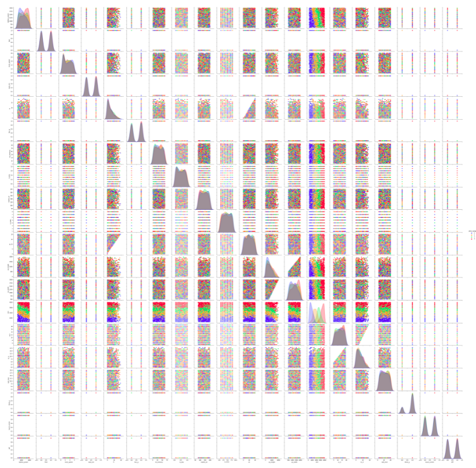
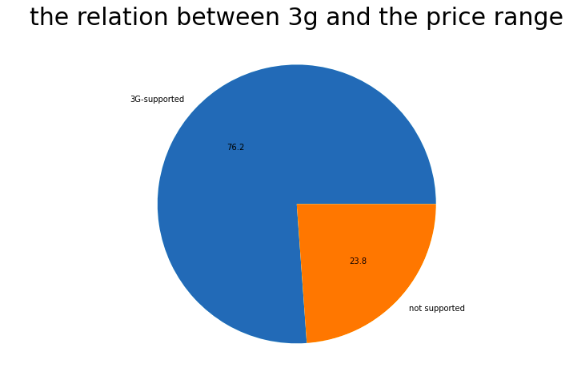
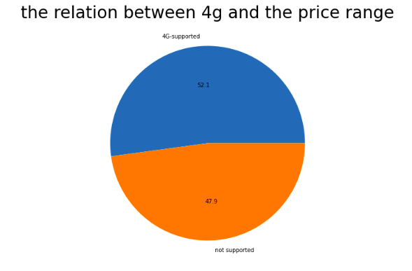
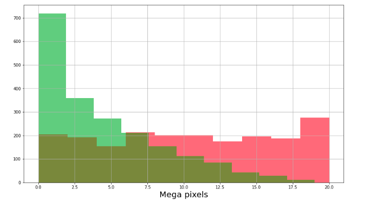
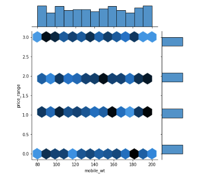
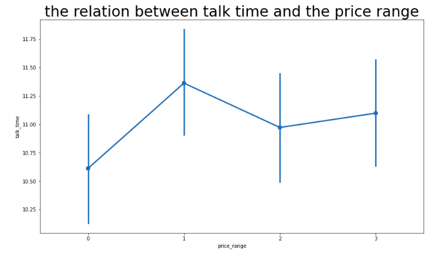
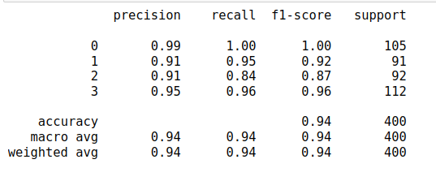
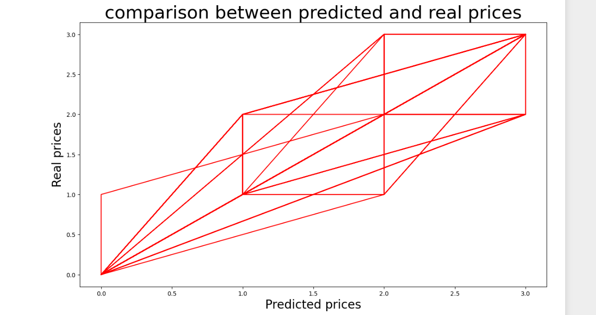
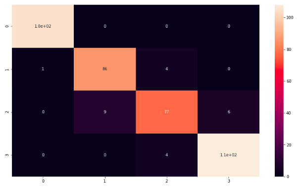

# Mobile price prediction

# Domain 
This project is in the technology sector.

# Problem statement 
In this Project,We're going to predict the price range of each mobile in the dataset based on the mobile specifications as : Battery power, 3G enabled , WiFi ,Bluetooth, Ram etc .

# Usage
- This kind of prediction will help companies to  estimate the price of mobiles of an mobile phone based on its specifications.
- Beside that it will help Consumers to verify that they are paying best price according to the specs of the mobile.

# Dataset
[This dataset](https://www.kaggle.com/datasets/fhabibimoghaddam/mobile-price-prediction) is [the Mobile price prediction dataset](https://www.kaggle.com/datasets/fhabibimoghaddam/mobile-price-prediction) from kaggle.

- id : ID.
- battery_power : Total energy a battery can store in one time measured in mAh.
- blue : Has bluetooth or not.
- clock_speed:speed at which microprocessor executes instructions.
- dual_sim : Has dual sim support or not.
- fc : Front Camera mega pixels.
- four_g : Has 4G or not.
- int_memory : Internal Memory in Gigabytes.
- m_dep : Mobile Depth in cm.
- mobile_wt : Weight of mobile phone.
- n_cores : Number of cores of processor.
- pc : Primary Camera mega pixels.
- px_height : Pixel Resolution Height.
- px_width : Pixel Resolution Width.
- ram : Random Access Memory in Megabytes.
- sc_h : Screen Height of mobile in cm.
- sc_w : Screen Width of mobile in cm.
- talk_time : longest time that a single battery charge will last when you are.
- three_g : Has 3G or not.
- touch_screen : Has touch screen or not.
- wifi : Has wifi or not.

# Contents
1. **About the data.**

2. **Importing the libraries and the data.**

3. **Understanding the data.**

4. **Data analysis and visualization.**

    

    1. How does ram is affected by price ?

    

    2. What is the relation between Internal Memory and Price Range ? 

    

    3. What is the percentage of Phones which support 3G ?

    
    

    4. What is the percentage of Phones which support 4G ?

    
    
    
    5. What is the relation between Battery power and Price Range ?

    

    6. Visualizing No of Phones vs Camera megapixels of front and primary camera.

    
    
    
    7. What is the relation between Mobile Weight and Price Range ?

        
    

    8. What is the relation between Talk time and Price Range ?

    
    
    

5. **Preprocessing the data.**

    1. Normalizing the continuous columns.

    2. Splitting the data.

6. **developing the machine learning models.**

    1. Linear regression.
    
    2. Logistic regression.

    3. Decision tree.

    4. SVM.

    5. K-Nearest neighbors.

    6. Random forest.

7. **Conclusion.**

8. **Prediction on the test set.**

# Evaluation metrics

The evaluations metrics that I am using in this project are accuracy and confusion matrix.
# Conclusion

logistic regression model outperforms other models in the mobile price classification problem with accuracy 94% .

